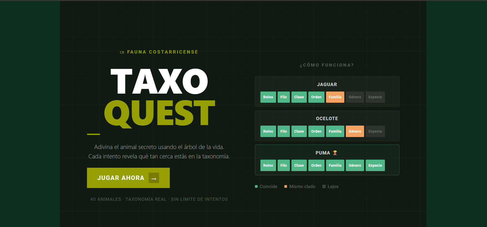
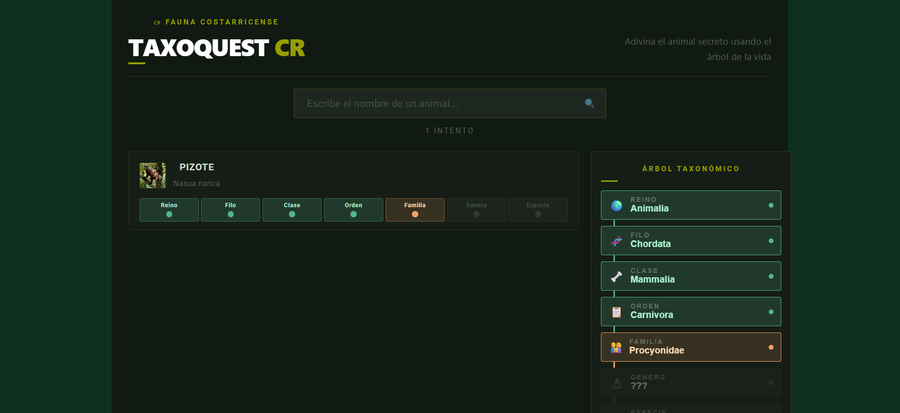
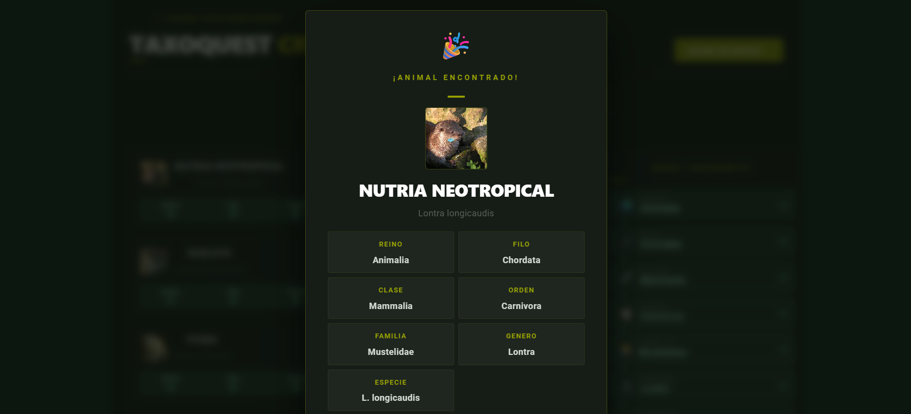

# TaxoQuest CR

Juego educativo en Vue 3 + Vite.

## Framework elegido
- **Vue 3** con Composition API y Single File Components.

## Descripción
TaxoQuest CR es un minijuego educativo de un nivel que reta al usuario a adivinar un animal secreto de fauna costarricense. El juego incluye:
- Pantalla de inicio.
- Pantalla de juego con selección de animales y árbol taxonómico.
- Pantalla de resultado.
- Carga dinámica de datos desde JSON (`public/data/animals.json`).
- Audio de aciertos, errores y victoria.
- Interfaz responsiva para escritorio y móvil.

## Requisitos cumplidos
- Framework: Vue 3.
- Mínimo 4 componentes reutilizables: `PantallaDeInicio`, `GameBoard`, `PantallaResultado`, `GuessInput`, `TaxonomyRow`, `ArbolTaxonomico`.
- Carga de datos JSON con `fetch()` en `useGameLogic.js`.
- Responsividad con CSS y media queries.
- Multimedia: audio propio en `public/sounds/` y imágenes de animales con licencia libre de Wikimedia Commons.
- Mínimo 5 commits en el historial.

## Ejecutar el proyecto
1. Clona el repositorio.
2. En la carpeta del proyecto ejecuta:
   ```bash
   npm install
   npm run dev
   ```
3. Abre la URL que indique Vite en el navegador.

> Si usas `pnpm`, puedes ejecutar `pnpm install` y `pnpm dev`.

## Estructura relevante
- `src/App.vue`
- `src/components/PantallaDeInicio.vue`
- `src/components/GameBoard.vue`
- `src/components/PantallaResultado.vue`
- `src/components/GuessInput.vue`
- `src/components/TaxonomyRow.vue`
- `src/components/ArbolTaxonomico.vue`
- `src/composables/useGameLogic.js`
- `public/data/animals.json`
- `public/sounds/Efecto acierto.mp3`
- `public/sounds/Efecto error.mp3`
- `public/sounds/Victoria triunfante.mp3`

## Capturas de pantalla






## Notas adicionales
- La elección de framework es **Vue 3** desde la inicialización del proyecto y se mantuvo durante todo el desarrollo.
- El historial de git contiene al menos 5 commits con avance progresivo.
- La aplicación se puede ejecutar con `npm install` y `npm run dev`.
- Más detalles de fuentes y referencias en `REFERENCIAS.md`.
